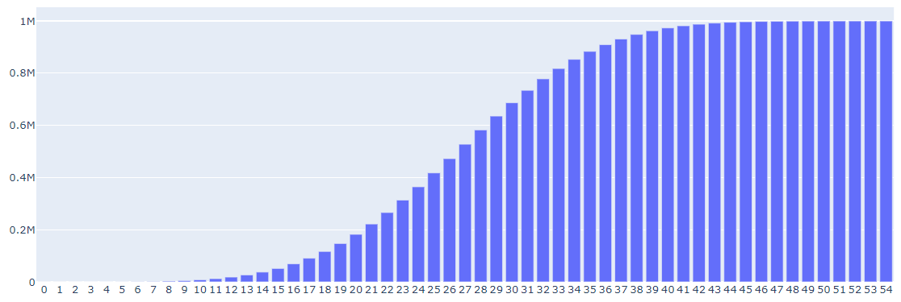
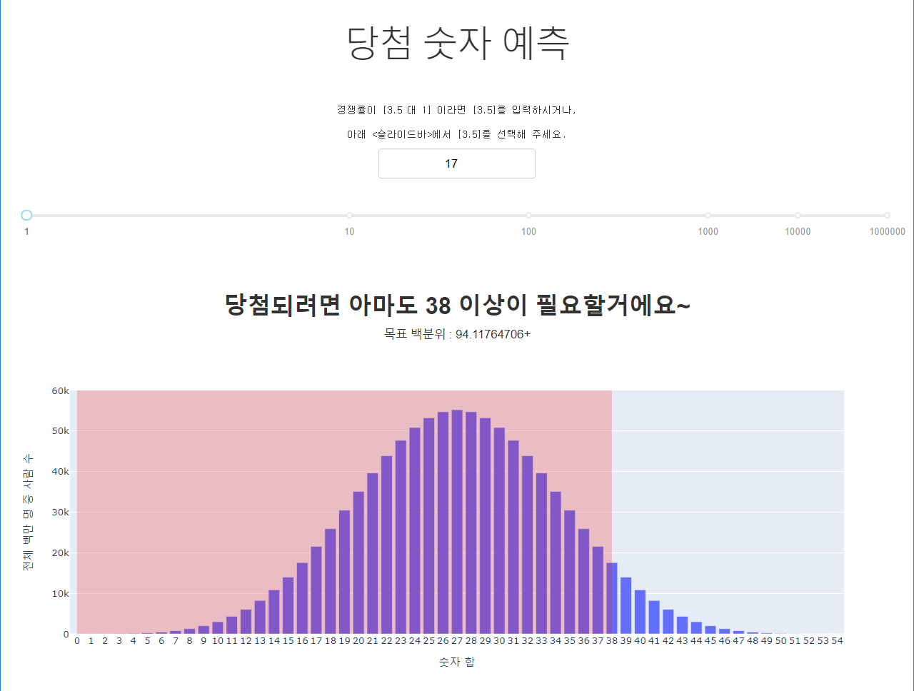

## ① 여러분의 업무나 회사 생활에서 개선이 필요했던 것은 무엇이었나요?

전자추첨을 이해하고, 용서하고 싶었습니다.


## ② 파이썬을 통해 어떻게 해결하고자 하였나요? (접근방법, 코딩방식 등)

1. 전자 추첨 이해
1. 당첨 숫자 예측
1. 시각화


#### 데모 : [http://172.19.148.94:8501/](http://172.19.148.94:8501/)
(혹시 접속이 불가능한 IP 대역이 있을지도 모릅니다)


## ③ 이전에 비해 어떻게 또는 얼마나 개선이 되었나요? (시간단축, 파급효과 등)

- **시간단축** : 포기가 빨라집니다.

- **파급효과** : 일일주차, 휴양소 등의 당첨 숫자 예측은 종종 근로 계획에 도움이 됩니다.


## ④ 파이썬 코드를 공유해주세요😊


*파이썬을 몰라도 누구나 응용하실 수 있도록 원리 위주로 설명하였습니다*


#### <27이 나올 확률>

숫자 6개의 합은 0부터 54까지 가능합니다.

즉, 0부터 54까지 쓰여 있는 `55면체 주사위`를 던지는 셈인데요.

보통의 주사위라면 각 숫자가 나올 확률이 `1/55`로 똑같겠지만, 전자추첨의 경우는 좀 다릅니다.


`000000`부터 `999999`까지, 정확히 `백만 가지 조합` 중,

`0`이 나오는 경우는 `000000` 밖에 없고,

`54`가 나오는 경우는 `999999` 밖에 없으니까요.

반면 합이 `1`이 되는 경우는 6가지나 있습니다. ( `000001` `000010` `000100` `001000` `010000` `100000` )

합이 `53`인 경우도 마찬가지고요. ( `99999팔` `9999팔9` `999팔99` `99팔999` `9팔9999` `팔99999` )

이런 식이라면 `54`의 절반인 `27`이 나오는 경우가 가장 많을 것 같은데요.


확인을 위해 다음 코드로 모든 경우의 수를 따져 봅니다.

```python
PDF = [0] * 55  # 각 숫자합이 발생한 횟수를 여기에 저장
for i0 in range(10):
    for i1 in range(10):
        for i2 in range(10):
            for i3 in range(10):
                for i4 in range(10):
                    for i5 in range(10):
                        PDF[i0 + i1 + i2 + i3 + i4 + i5] += 1

for i in range(55):
    print(f'{i:>2} ==> {PDF[i]:>6,}')
```

```
# 결과

 0 ==>      1
 1 ==>      6
 2 ==>     21

26 ==> 54,747
27 ==> 55,252    <== 주목
28 ==> 54,747

52 ==>     21
53 ==>      6
54 ==>      1
```


합이 `27`인 경우가 `백만 가지 조합` 중 55,252번 나타나는군요.

그림으로 보면 다음과 같습니다.


만약 백만 명이 추첨에 참여했다면 55,252명이 `27`을 뽑게 됩니다.

즉 `27`을 받을 확률은 `5.5%` 입니다.


#### <27보다 작은 수가 나올 확률>

그렇다면 `27`보다 작은 숫자가 나올 확률은 얼마일까요?

다음처럼 부지런히 더해보는 방법이 있겠는데요.

`0이 나오는 경우의 수` + `1이 나오는 경우의 수` + `...` + `26이 나오는 경우의 수`

결과는 472,374명, 즉 `47.2%`가 됩니다.


`26`까지의 `누적 확률`뿐만 아니라, 하는 김에 모든 숫자 별  `누적 확률`을 미리-한번-몽창 뽑아 둡니다.

```python
CDF = [0] * 55  # 각 숫자합이 발생한 횟수를 누적해 가며 여기에 저장
for i in range(55):
    CDF[i] = CDF[i-1] + PDF[i]

for i in range(55):
    print(f'{i:>2} ==> {CDF[i]:>9,}')
```

```
# 결과

 0 ==>         1
 1 ==>         7
 2 ==>        28

26 ==>   472,374    <== 주목
27 ==>   527,626
28 ==>   582,373

52 ==>   999,993
53 ==>   999,999
54 ==> 1,000,000
```


그림으로 보면 다음과 같습니다.




#### <당첨 숫자 예측>

만약 `[2 대 1]`의 경쟁률을 뚫어야 한다면 `50%`의 경쟁자를 물리쳐야 하니까, 우리가 넘어서야 하는 이 `50%`를 `목표 백분위`라고 부르겠습니다.

```
# 미리 계산해 두었던 <누적 확률> 소환

26 ==>   472,374 == 대략 47%
27 ==>   527,626 == 대략 53%
```

`27`을 뽑은 사람은 위 두 확률 사이(47% ~ 53%) 어딘가를 차지하게 됩니다. (동률 처리 방식에 따라 달라지겠죠)

즉, 운이 좋으면 `목표 백분위` `50%`를 넘을 수도 있는 괜찮은 숫자를 받은 셈입니다.


이처럼 `목표 백분위`가 위 `누적 확률` 그래프에서 어느 구간에 해당하는지 따져 보는 방법으로 당첨 숫자를 예측할 수 있습니다.


아래 코드는 경쟁률이 [17 대 1]일 때의 당첨 숫자를 예측합니다.

```python
rate = 17
print(f'경쟁률 [{rate} 대 1]')

percentile = 1.0 - (1.0 / rate)
print(f'목표 백분위 : {percentile * 100.0}+')

percentile *= 1000000
predict = 0
for i in range(55):
    if percentile < CDF[i]:
        predict = i
        break

print(f'당첨되려면 아마도 {predict} 이상이 필요할거에요~')
```

```
# 결과

경쟁률 [17 대 1]
목표 백분위 : 94.11764705882352+
당첨되려면 아마도 38 이상이 필요할거에요~
```


#### <쇼트 프로그램>

그런데 `확률 분포`는 늘 똑같으니까 (지금까지의 코드들은 모두 지우고) 다음처럼 짧게 쓸 수 있겠습니다.

```python
CDF = [     1,       7,      28,      84,     210,     462,     924,
          1716,    3003,    5005,    8002,   12334,   18396,   26628,
         37500,   51492,   69069,   90651,  116578,  147070,  182197,
        221859,  265776,  313488,  364365,  417627,  472374,  527626,
        582373,  635635,  686512,  734224,  778141,  817803,  852930,
        883422,  909349,  930931,  948508,  962500,  973372,  981604,
        987666,  991998,  994995,  996997,  998284,  999076,  999538,
        999790,  999916,  999972,  999993,  999999, 1000000]


# 경쟁률이 [3.5 대 1] 이면 rate = 3.5
def rate_to_percentile(rate):
    return 0 if (rate < 1.0) else (1.0 - (1.0 / rate))


def predict(target_percentile):
    rank = target_percentile * CDF[-1]
    for i in range(len(CDF)):
        if rank < CDF[i]:
            return i
    return len(CDF) - 1
```


마지막으로, 혹시 문제는 없는지 몇몇 값을 테스트해 봅니다.

```python
def _test():
    max_num = len(CDF) - 1  # 54

    import sys

    percentile = rate_to_percentile(-sys.float_info.max)
    pred = predict(percentile)
    assert pred == 0

    percentile = rate_to_percentile(0)
    pred = predict(percentile)
    assert pred == 0

    percentile = rate_to_percentile(1/1e6)
    pred = predict(percentile)
    assert pred == 0

    percentile = rate_to_percentile(1)
    pred = predict(percentile)
    assert pred == 0

    percentile = rate_to_percentile(2)
    pred = predict(percentile)
    assert pred == max_num * 0.5  # 27

    percentile = rate_to_percentile(1e6)
    pred = predict(percentile)
    assert pred == max_num

    percentile = rate_to_percentile(sys.float_info.max)
    pred = predict(percentile)
    assert pred == max_num


if __name__ == '__main__':
    _test()
```


#### <시각화>

링크 : [http://172.19.148.94:8501/](http://172.19.148.94:8501/)




[Dash](https://plotly.com/dash/)를 사용했습니다.

```python
#
# 돌아만 가도록 급조된 코드입니다;;
#

import plotly.express as px
import dash
from dash.dependencies import Input
from dash.dependencies import Output
from dash.dependencies import State
import dash_core_components as dcc
import dash_html_components as html

import lottery_prob as prob


_mark = [0, 400, 600, 800, 900, 1000]
_conv = [0, 10, 100, 1000, 10000, 1000000]

external_stylesheets = ['https://codepen.io/chriddyp/pen/bWLwgP.css']

server = dash.Dash(__name__, external_stylesheets=external_stylesheets)

fig_pdf = px.bar(y=prob.PDF,
                 labels={'x': '숫자 합', 'y': '전체 백만 명 중 사람 수'})

fig_pdf.add_shape(type="rect",
                  x0=0, y0=0, x1=27, y1=60000,
                  line=dict(width=0),
                  fillcolor='rgba(255, 0, 0, 0.2)')

fig_pdf.update_layout(title_x=0.5,
                      xaxis=dict(tickmode='linear')
                      )

server.layout = html.Div(children=[
    html.Center([
        html.Br(),

        dcc.Markdown('''
            # 당첨 숫자 예측
        '''),

        html.Br(),

        dcc.Markdown('''
            ```경쟁률이 [3.5 대 1] 이라면 [3.5]를 입력하시거나,```
        '''),

        dcc.Markdown('''
            ```아래 <슬라이드바>에서 [3.5]를 선택해 주세요.```
        '''),

        html.Div(id='output-warning',
                 style={'color': 'red', 'margin-bottom': '0px'}),

        dcc.Input(
            id='rate',
            type='number',
            placeholder='경쟁률',
            min=1,
            max=1e6,
            value=2.0,
            style={'textAlign': 'center', 'margin-bottom': '40px'}),

        dcc.Slider(
            id='rate-slider',
            min=int(_mark[1]*0.1),
            max=1000,
            step=1,
            marks={
                int(_mark[1]*0.1): '1',
                _mark[1]: f"{_conv[1]:,}",
                _mark[2]: f"{_conv[2]:,}",
                _mark[3]: f"{_conv[3]:,}",
                _mark[4]: f"{_conv[4]:,}",
                _mark[5]: f"{_conv[5]:,}",
            },
            value=int(_mark[1]*0.2),
            updatemode='drag'),

        html.Div(id='output-predict',
                 style={'font-weight': 'bold',
                        'font-size': '2.0em',
                        'margin-top': '60px',
                        'margin-bottom': '0px'}),

        html.Div(id='output-percentile',
                 style={'margin-top': '0px', 'margin-bottom': '0px'}),

        dcc.Graph(id='graph-pdf',
                  figure=fig_pdf),

        html.A("Null - 알고리즘 설명 및 코드",
               href='https://null.ncsoft.com/questions/4781', target="_blank"),
    ])
])


def convert_slider_value(value):
    for i in range(1, len(_mark)):
        if value <= _mark[i]:
            return (value - _mark[i-1]) * (_conv[i] - _conv[i-1]) / (_mark[i] - _mark[i-1]) + _conv[i-1]


@server.callback(
    Output('graph-pdf', 'figure'),
    [Input('rate', 'value')],
    [State('graph-pdf', 'figure')])
def update_output_input(value, fig):
    if value is not None:
        target_percentile = prob.rate_to_percentile(value)
        fig['layout']['shapes'][0]['x1'] = prob.predict(target_percentile)
    return fig


@server.callback(
    Output('rate', 'value'),
    [Input('rate-slider', 'value')])
def update_output_slider(value):
    return convert_slider_value(value)


@server.callback(
    [Output('output-warning', 'children'),
     Output('output-percentile', 'children'),
     Output('output-predict', 'children')],
    [Input('rate', 'value')])
def update_output_guess(value):
    if value is None:
        return [f'유효 입력 범위 : [1 ~ 백만]', f'목표 백분위 : ???', f'당첨되려면 아마도 ??? 이상이 필요할거에요~']
    else:
        target_percentile = prob.rate_to_percentile(value)
        pred = prob.predict(target_percentile)
        return [f'', f'목표 백분위 : {target_percentile*100:.8f}+', f'당첨되려면 아마도 {pred} 이상이 필요할거에요~']


if __name__ == '__main__':
    server.run_server(host='0.0.0.0', port=8501, debug=False)
```


#### <참고>

전자추첨의 확률 분포는 [정규 분포](https://en.wikipedia.org/wiki/Normal_distribution)가 아니라 [Irwin–Hall 분포](https://en.wikipedia.org/wiki/Irwin%E2%80%93Hall_distribution)입니다.


## ⑤ 파이썬을 공부하고 있는 사우들에게 Tip을 주고 싶은 것이 있다면요?

"파이썬 한번 해볼까?" 생각 중이신 분들에게 Tip을 드리자면,

바로 써먹기 좋은 언어는 내부 작동 원리를 이해하기가 오히려 어렵더군요.

괜한 부담감 때문에 시작을 미루는 것보다는 우선 실용적인 관점으로 가볍게 시작하시는 걸 추천해 드립니다.

모니터에 늘 `창` 하나 켜 두고, 계산기 대용으로 사용해 보시는 것도 좋을 것 같습니다.

어떤 `창`을 켜 두는 게 좋을까 생각해보면,

- [IPython](https://ipython.org/)을 실행한 터미널
- [쥬피터 노트북](https://jupyter.org/) ( [Colab](https://colab.research.google.com/)처럼 온라인 무료 서비스도 많습니다 )
- [비쥬얼 스튜디오 코드](https://code.visualstudio.com/) + [파이썬 확장](https://marketplace.visualstudio.com/items?itemName=ms-python.python)

..등이 먼저 떠오릅니다.


만약 게임프로그래머라면 다음과 같은 코드에 흥미를 느끼실지도 모르겠네요.

- [몇 백 줄로 만든 마인크래프트](https://github.com/fogleman/Minecraft)


마지막으로 눈요기용 링크 하나 남깁니다.

- [깝놀 파이썬](https://github.com/vinta/awesome-python)
